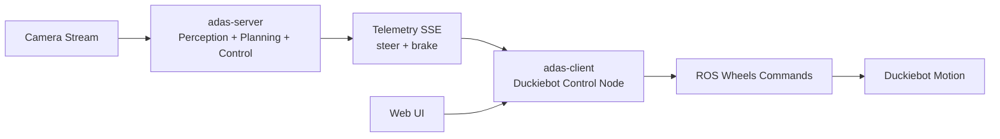

# ADAS ROS Monorepo

High-level workspace for an end-to-end edge ADAS driving stack split across two Git submodules:

- `adas-server/`: real-time perception and control backend (steer + brake inference)
- `adas-client/`: Duckiebot ROS web-control client that applies those commands to wheels

This repository is the integration entry point. Detailed implementation, setup, and troubleshooting live in each submodule README.

---

## What This Project Delivers

- Real-time monocular ADAS pipeline (lane/road + object perception)
- Control output generation (`steer`, `brake`) using trajectory planning logic
- Browser-based Duckiebot control UI with manual/auto modes
- A practical bridge from AI inference to physical robot actuation

---

## System Architecture



### Component Roles

| Component     | Responsibility                                                            | Typical Runtime               |
| ------------- | ------------------------------------------------------------------------- | ----------------------------- |
| `adas-server` | Runs inference pipeline and publishes steering/braking telemetry          | Laptop / Edge device / Jetson |
| `adas-client` | Converts control input into Duckiebot wheel commands and hosts control UI | Duckiebot (Docker + ROS)      |

---

## Repository Layout

```text
adas-ros/
├── README.md           # Global entry point (this file)
├── adas-server/        # Git submodule: ADAS backend
└── adas-client/        # Git submodule: Duckiebot ROS client
```

---

## Getting Started (Submodule-Aware)

If you are new to Git submodules, clone with:

```bash
git clone --recurse-submodules https://github.com/SrabanMondal/adas-ros.git
cd adas-ros
```

If you already cloned without submodules:

```bash
git submodule update --init --recursive
```

---

## Quick Run Flow

1. Start `adas-server` to generate ADAS telemetry from camera input.
2. Start `adas-client` on Duckiebot to consume control signals and publish ROS wheel commands.
3. Use the client web panel for manual driving or auto mode with SSE input.

For full setup and run commands, use:

- [adas-server/README.md](adas-server/README.md)
- [adas-client/README.md](adas-client/README.md)

---

## Interface Contract (Integration Point)

The two modules integrate around control semantics:

```json
{
  "steer": 12.5,
  "brake": 0.3
}
```

- `steer`: signed steering command (degrees)
- `brake`: normalized braking command (`0.0` to `1.0`)

---

## Tech Snapshot

- **Backend AI/Control:** Python, OpenCV, ONNX/TensorRT/OpenVINO, MPC-style planning, FastAPI
- **Robot Client:** ROS (Noetic), Flask, Duckietown tooling (`dts`), Docker
- **Transport:** HTTP + SSE telemetry and ROS wheel command publishing

---

## Development Notes

- Submodules are version-pinned; this repo tracks specific commits for reproducible integration.
- Pull latest submodule changes when needed:

```bash
git submodule update --remote --recursive
```

- After submodule updates, commit the changed submodule pointers in this root repository.

---

## Detailed Documentation

- Server pipeline details, model handling, and performance: [adas-server/README.md](adas-server/README.md)
- Duckiebot control architecture and operations: [adas-client/README.md](adas-client/README.md)
